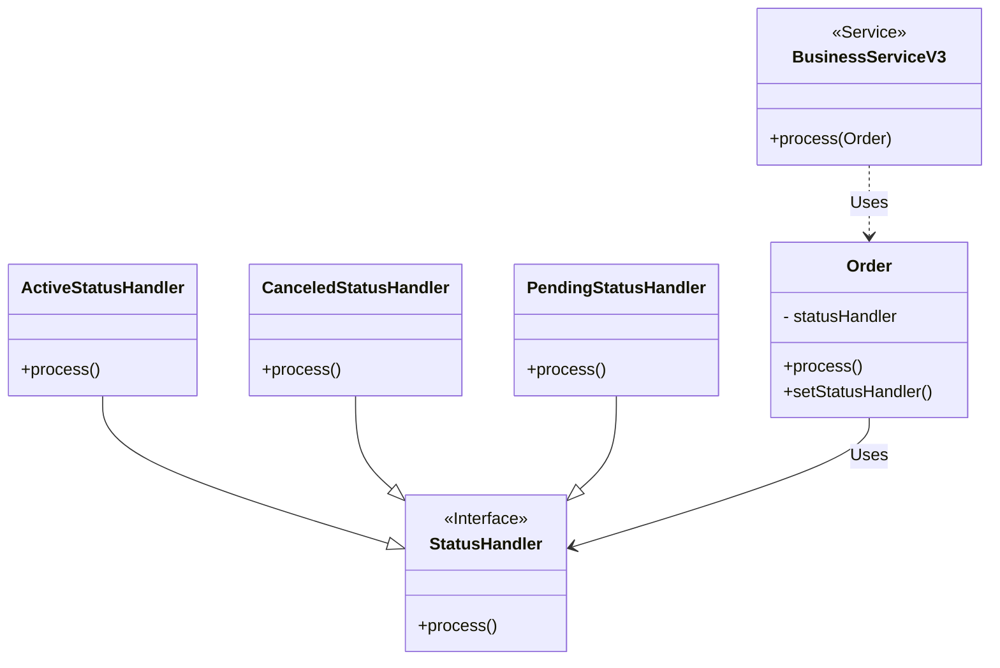

## Example context

Given a generic entity domain like `Order`, this a status like `active`, `pending` and `canceled`

```java title="Order.java"
public class Order {
  private long id;
  private Status status;
  // other fields omitted

  // highlight-next-line
  public Status getStatus() {
    return status;
  }
  // other methods omitted
}
```

```java title="Status.java"
public enum Status {
  ACTIVE, PENDING, CANCELED
}
```

## Handling Status-Dependent logic in an `Order` class

Let's explore different approaches to implement logic based on the order's status.

### Version 1: Direct Comparison

```java title="BusinessServiceV1.java"
public void process(Order order) {

  // highlight-next-line
  if (order.getStatus() == Status.ACTIVE) {
    // some important logic here
  }
}
```

This simple approach is often sufficient for basic use cases. It's easy to understand and works well when the logic is straightforward. However, it can lead to **tight coupling** between the `BusinessService` and the internal representation of the `Order` status.

### Version 2: Encapsulation with a Method

```java title="BusinessServiceV2.java"
public void process(Order order) {

  // highlight-next-line
  if (order.isActive()) {
    // some important logic here
  }
}
```

```java title="Order.java"
public class Order {
  private long id;
  private Status status;
  // other fields omitted

  // highlight-start
  public boolean isActive() {
    return status == Status.ACTIVE;
  }
  // highlight-end
  // other methods omitted
}
```

By introducing the `isActive()` method, we encapsulate the knowledge of what constitutes an **"active"** order within the `Order` class. This improves readability and reduces coupling. The `BusinessService` doesn't need to know about the underlying enum values.

#### Benefits of Encapsulation

Encapsulation is a core principle of object-oriented programming. In this case, it provides several benefits:

- **Information Hiding:** The `BusinessService` only needs to know about the public interface of the `Order` class, not its internal details.
- **Flexibility:** If the implementation of how status is determined changes in the future, you only need to update the `isActive()` method.
- **Reduced Errors:** You can add validation within the `isActive()` method to prevent invalid states.
- **Easy to Test:** Isolating the status logic makes it easier to write unit tests for the `isActive()` method.

### Version 3: Polymorphism using State pattern

:::warning

Consider this approach for complex business logic where behavior varies significantly depending on the order's status.

:::

Using Polymorphism, as shown in this diagram:



In the code, each concrete implementation of `StatusHandler` encapsulates the logic for a specific order status.

```java title="BusinessServiceV3.java"
public void process(Order order) {
  // highlight-next-line
  order.process();
}
```

```java
public interface StatusHandler {
  void process();
}

```

```java title="Order.java"
public class Order {
  private long id;
  private StatusHandler statusHandler;
  // other fields or methods omitted

  public void process() {
    statusHandler.process();
  }

  public void setStatusHandler(StatusHandler statusHandler) {
    this.statusHandler = statusHandler;
  }
}
```

```java title="ActiveStatusHandler.java"
public class ActiveStatusHandler implements StatusHandler {

  private final Order order;
  private final StatusHandler nextStatusHandler;

  public ActiveStatusHandler(Order order, StatusHandler nextStatusHandler) {
    this.order = order;
    this.nextStatusHandler = nextStatusHandler;
  }

  @Override
  public void process() {
    // do some important logic

    // In some cases maybe is needed to change the status of the order, in that case you can use:
    order.setStatusHandler(nextStatusHandler);
  }
}
```

:::tip

One way of using state patterns as finite state machine, as you can see in the `ActiveStatusHandler` there is a transaction to another `StatusHandler`

:::

```java title="CanceledStatusHandler.java"
public class CanceledStatusHandler implements StatusHandler {
  @Override
  public void process() {
    // do nothing
  }
}
```

```java title="PendingStatusHandler.java"
public class PendingStatusHandler implements StatusHandler {
  @Override
  public void process() {
    // do some assertions
    throw new IllegalStateException("Process can be executed in status pending");
  }
}
```

This approach also needs a modification in how `Order` objects are created.

```java title="OrderFactory.java"
public Order create(OrderDB orderDB) {
  var order = createFromDB(orderDB);
  order.setStatusHandler(createStatusHandler(order, Status.valueOf(orderDB.status())))
  return order;
}

public StatusHandler createStatusHandler(Order order, Status status) {
  return switch(status) {
    case ACTIVE -> new ActiveStatusHandler(order, new PendingStatusHandler());
    case CANCELED -> new CanceledStatusHandler();
    case PENDING -> new PendingStatusHandler();
  };
}
```

When status-specific logic becomes more complex, a polymorphic approach inspired by the State Pattern might be suitable.

Each order status type (`active`, `pending`, `canceled`) is represented by a separate class that encapsulate the logic (eg., `ActiveStatusHandler`, `CanceledStatusHandler`, `PendingStatusHandler`), each acting as a state object encapsulating the specific logic for that state. The `process()` method is overridden to provide the appropriate behavior.

In the State Pattern, an object's behavior changes based on its internal state, which is represented by a separate state object. Here, each `StatusHandler` concrete implementation class acts as a state object, encapsulating the specific logic for that state.

#### Main benefits

- **Open/Closed Principle (OCP):** New status handlers (representing new states) can be added without modifying the existing `Order` or `BusinessService` classes. This makes the system more flexible and easier to maintain as requirements evolve.
- **Easy to Test:** The logic for each status is isolated in its own class, making unit testing straightforward.
- **External Calls:** Status handlers can easily interact with other objects (e.g., repositories, services) to fulfill their responsibilities.

## When to Choose Which Version

- **Version 1:** Simple cases where logic is unlikely to change, therefore not recommended.
- **Version 2:** Improved readability and maintainability when the logic is still relatively simple.
- **Version 3:** Complex logic with significant behavioral differences between states, or when you anticipate frequent changes or additions to the status types. Embracing the State Pattern enhances organization, extensibility, and maintainability in these scenarios.

## Additional Considerations

- **State Pattern vs. Strategy Pattern:** The State Pattern is ideal when the object's behavior changes fundamentally depending on its internal state. The Strategy Pattern is more suitable for selecting an algorithm at runtime.

## Resources:

- [State Pattern - Wikipedia](https://en.wikipedia.org/wiki/State_pattern)
- [Open Close Principle - Wikipedia](https://en.wikipedia.org/wiki/Open%E2%80%93closed_principle)
- [Head First Design Patterns, 2nd Edition](https://www.oreilly.com/library/view/head-first-design/9781492077992/)

**Note:** This article was written with the assistance of Gemini, an AI language model developed by Google.
