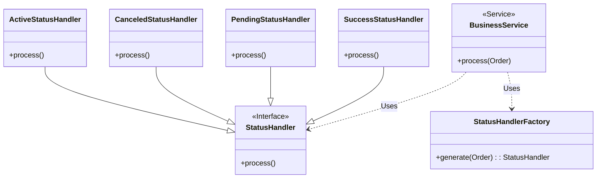

Let's explore how to implement status-based logic in a way that is both robust and easy to understand.

<!-- truncate -->

More than once, you have encountered a scenario where a simple class representing a domain entity has a `status`, like this:

```java title="Order.java"
public class Order {
  private long id;
  private Status status;
  // other fields omitted

  public Status getStatus() {
    return status;
  }
  // other methods omitted
}
```

This status could have different status, for example:

```java title="Status.java"
public enum Status {
  ACTIVE, PENDING, CANCELED
}
```

Now you have to implement some logic for that `Order` entity based on the status.

## Simple direct Comparison

This is the simplest approach. It's easy to understand and works well when the logic is straightforward.

```java title="BusinessService.java"
public void process(Order order) {
  // highlight-next-line
  if (order.getStatus() == Status.ACTIVE) {
    // some important logic here
  }
}
```

However, one downside is that `BusinessService` has to know about the `Status.ACTIVE` in order to check its status. Also if we need to add another process class that requires the order in status active we must to duplicate the `if` expression, like this:

```java title="AnotherBusinessService.java"
public void anotherProcess(Order order) {
  // highlight-next-line
  if (order.getStatus() == Status.ACTIVE) {
    // even more important logic here!
  }
}
```

## Encapsulation with a Method

Now we have two classes (`BusinessService` and `AnotherBusinessService`) with the same `if` expression. But now the business is asking for new changes:

> An order is active when the status is `active` and the creation time is not older than 1 month.

Now we need to add an extra condition. We could add something like this in both locations:

```java
order.getStatus() == Status.ACTIVE &&
  order.getCreatedDate().before(order.getCreatedDate().plus(1, Month))`
```

- Do we want to have that in two parts in our projects?
- Do we want to have a big `if` expression?

If your answer is yes, then you can stop reading this. 😀

Time to introduce some encapsulation method inside the `Order` class.

:::danger

Some developers have a strong tendency to introduce **"utility methods" or "helpers method"** 😠

Please **resist this temptation**!! Use the existing objects within your current context instead.

:::

```java title="Order.java"
public class Order {
  // highlight-next-line
  public boolean isActive() {
    return status == Status.ACTIVE && isOldThan(Month.of(1));
  }
  private boolean isOldThan(Period period) {
    return createdDate.isBefore(Now.less(period));
  }
  // other methods omitted
}
```

Now the `BusinessService` and the `AnotherBusinessService` can just call the `order.isActive()`

```java title="BusinessService.java"
public void process(Order order) {
  // highlight-next-line
  if (order.isActive()) {
    // some important logic here
  }
}
```

We encapsulate the knowledge of what constitutes an **"active"** order within the `Order` class. This improves readability and reduces coupling. The consumers doesn't need to know about the underlying enum values or any other criteria.

## Using polymorphism with strategies

Business requires more changes (again!), **for each status** we need to apply some logic. For example:

| Description                      | Initial Status                    | Result Status |
| -------------------------------- | --------------------------------- | ------------- |
| Do some important logic          | Active                            | Success       |
| Set order pending                | Active and old than 1 month       | Pending       |
| Send email when order is pending | Pending                           | Sent          |
| Cancel order after 1 month       | Sent and 1 month in status `Sent` | Cancel        |

Using Polymorphism, as shown in this diagram:



In the code, each concrete implementation of `StatusHandler` encapsulates the logic for a specific order status. This in other words, these are different **strategies**.

The business service class now needs to get the handler according to the order, then execute the handler.

Something like this:

```java title="BusinessService.java"
public void process(Order order) {
  var handler = statusHandlerFactory.generate(order)
  var orderProcessed = handler.process();
}
```

Creation of the specific handlers are moved to the `StatusHandlerFactory`:

```java title="StatusHandlerFactory.java"
public StatusHandler generate(Order order) {
  return switch(status) {
    case ACTIVE -> new ActiveStatusHandler(order);
    case CANCELED -> new CanceledStatusHandler(order);
    case PENDING -> new PendingStatusHandler(order, emailSenderService);
    // ... More status if are required
  };
}
```

Example implementation of one of this handlers:

```java title="ActiveStatusHandler.java"
public class PendingStatusHandler implements StatusHandler {

  private final Order order;
  private final EmailSenderService emailSenderService;

  public PendingStatusHandler(Order order, EmailSenderService emailSenderService) {
    // Defensive programming :)
    Assert.isTrue(order.isPending(), "Order must be pending")
    this.order = order;
    this.emailSenderService = emailSenderService;
  }

  @Override
  public Order process() {
    // do some important logic
    var emailContent = prepareEmailContent(order);
    var email = order.email();

    emailSenderService.send(email, emailContent);

    // return a copy with new status
    return order.withStatusSent();
  }
}
```

As you can see the handler is more complex, and could be even more complex and extensible in the future.

### Main benefits

- **Open/Closed Principle (OCP):** New status handlers (representing new states) can be added without modifying the existing `Order` or `BusinessService` classes. This makes the system more flexible and easier to maintain as requirements evolve.
- **Easy to Test:** The logic for each status is isolated in its own class, making unit testing straightforward.
- **External Calls:** Status handlers can easily interact with other objects (e.g., repositories, services) to fulfill their responsibilities.

## Using state pattern

Another way to implemented this polymorphic way is to implemented the `State` design patterns, the main difference is that the object `Order` will behave different according to their internal state, something like this:

```java
public class Order {
  private Status status;
  private StateHandler stateHandler;

  public void process() {
    stateHandler.process();
  }

  public void setStateHandler(StateHandler stateHandler) {
    this.stateHandler = stateHandler
  }

}
```

**I don't prefer this approach** , because if forces `Order` to be mutable and allow to `stateHandler` to be `null`.

:::tip

Design patterns are like a **glossary, a common vocabulary,** rather than an **specific recipe**, implementations can vary but the idea is the same.

:::

## Conclusion

When you develop your system, begin with a simplest approach. Don't rush to implement complex patterns like strategy or state at the beginning. Let your your requirements and business rules guide the implementation, and embrace the evolutionary design, gradually adding more and more abstraction as needed.

:::tip

**Don't shoot your self in the foot!**

:::

## Resources

- [Strategy Pattern - Wikipedia](https://en.wikipedia.org/wiki/Strategy_pattern)
- [State Pattern - Wikipedia](https://en.wikipedia.org/wiki/State_pattern)
- [Open Close Principle - Wikipedia](https://en.wikipedia.org/wiki/Open%E2%80%93closed_principle)
- [Head First Design Patterns, 2nd Edition](https://www.oreilly.com/library/view/head-first-design/9781492077992/)
