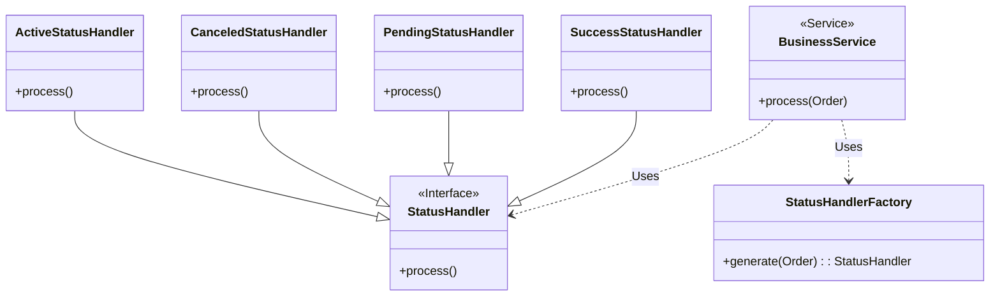

<BlogTOCMobile/>

En este artículo, exploraremos cómo implementar la lógica basada en el estado de una entidad de dominio de manera robusta y fácil de entender.

<!-- truncate -->

En más de una ocasión, te habrás encontrado con la situación en la que una clase simple que representa una entidad de dominio tiene un `status`, como este:

```java title="Order.java"
public class Order {
  private long id;
  private Status status;
  // other fields omitted

  public Status getStatus() {
    return status;
  }
  // other methods omitted
}
```

Puede tener diferentes valores:

```java title="Status.java"
public enum Status {
  ACTIVE, PENDING, CANCELED
}
```

Ahora tienes que implementar alguna lógica para esa entidad Order (Pedido) basada en su estado.

## Comparación Directa Simple

Este es el enfoque más simple. Es fácil de entender y funciona bien cuando la lógica es sencilla.

```java title="BusinessService.java"
public void process(Order order) {
  // highlight-next-line
  if (order.getStatus() == Status.ACTIVE) {
    // some important logic here
  }
}
```

Sin embargo, una desventaja es que `BusinessService` tiene que conocer el valor `Status.ACTIVE` para poder comprobar el estado. Además, si necesitamos añadir otra clase de proceso que requiera que el pedido esté en estado activo, debemos duplicar la expresión `if`, así:

```java title="AnotherBusinessService.java"
public void anotherProcess(Order order) {
  // highlight-next-line
  if (order.getStatus() == Status.ACTIVE) {
    // even more important logic here!
  }
}
```

## Encapsulación con un Método

Ahora tenemos dos clases (`BusinessService` y `AnotherBusinessService`) con la misma expresión `if`. Pero ahora el negocio está pidiendo nuevos cambios:

> Un pedido está activo cuando el estado es `activo` y la fecha de creación no es anterior a 1 mes.

Este nuevo requisito introduce una condición adicional. Podríamos añadir algo como esto en ambas ubicaciones:

```java
order.getStatus() == Status.ACTIVE &&
  order.getCreatedDate().before(order.getCreatedDate().plus(1, Month))`
```

- ¿Queremos tener eso duplicado en dos partes de nuestros proyectos?
- ¿Queremos tener una expresión `if` enorme y difícil de leer?

Si tu respuesta es sí, entonces puedes dejar de leer esto. 😀

Es hora de introducir un método dentro de la clase `Order`.

:::danger

Algunos desarrolladores tienen una fuerte tendencia a introducir **"métodos de Util" o "métodos helpers"** 😠

¡Por favor, **resiste esta tentación**! En lugar de eso, utiliza los objetos existentes dentro de tu contexto actual.

:::

```java title="Order.java"
public class Order {
  // highlight-next-line
  public boolean isActive() {
    return status == Status.ACTIVE && isOldThan(Month.of(1));
  }
  private boolean isOldThan(Period period) {
    return createdDate.isBefore(Now.less(period));
  }
  // other methods omitted
}
```

Ahora, `BusinessService` y `AnotherBusinessService` pueden simplemente llamar al método `order.isActive()`.

```java title="BusinessService.java"
public void process(Order order) {
  // highlight-next-line
  if (order.isActive()) {
    // some important logic here
  }
}
```

Encapsulamos el conocimiento de lo que constituye un pedido **"activo"** dentro de la clase `Order`. Esto mejora la legibilidad y reduce el acoplamiento. Los consumidores (clases que usan la clase `Order`) no necesitan saber sobre los valores internos del enum o cualquier otro criterio.

## Uso de Polimorfismo con Estrategias

El negocio requiere más cambios (¡otra vez!), **para cada estado** necesitamos aplicar alguna lógica. Por ejemplo:

| Descripción                               | Estado Inicial                      | Estado Final |
| ----------------------------------------- | ----------------------------------- | ------------ |
| Realizar alguna lógica importante         | Activo                              | Exitoso      |
| Establecer pedido como pendiente          | Activo y con más de 1 mes de creado | Pendiente    |
| Enviar correo si el pedido está pendiente | Pendiente                           | Enviado      |
| Cancelar pedido después de 1 mes          | Enviado y 1 mes en estado `Enviado` | Cancelado    |

Usando Polimorfismo, como se muestra en este diagrama:



En el código, cada implementación concreta de `StatusHandler` encapsula la lógica para un estado de pedido específico. En otras palabras, estas son diferentes **estrategias**.

La clase de servicio de negocio ahora necesita obtener el manejador (handler) de acuerdo con el pedido y luego ejecutarlo.

Algo como esto:

```java title="BusinessService.java"
public void process(Order order) {
  var handler = statusHandlerFactory.generate(order)
  var orderProcessed = handler.process();
}
```

La creación de los manejadores específicos se mueve a la clase `StatusHandlerFactory`:

```java title="StatusHandlerFactory.java"
public StatusHandler generate(Order order) {
  return switch(status) {
    case ACTIVE -> new ActiveStatusHandler(order);
    case CANCELED -> new CanceledStatusHandler(order);
    case PENDING -> new PendingStatusHandler(order, emailSenderService);
    // ... More status if are required
  };
}
```

Ejemplo de implementación de uno de estos manejadores:

```java title="ActiveStatusHandler.java"
public class PendingStatusHandler implements StatusHandler {

  private final Order order;
  private final EmailSenderService emailSenderService;

  public PendingStatusHandler(Order order, EmailSenderService emailSenderService) {
    // Defensive programming :)
    Assert.isTrue(order.isPending(), "Order must be pending")
    this.order = order;
    this.emailSenderService = emailSenderService;
  }

  @Override
  public Order process() {
    // do some important logic
    var emailContent = prepareEmailContent(order);
    var email = order.email();

    emailSenderService.send(email, emailContent);

    // return a copy with new status
    return order.withStatusSent();
  }
}
```

Como puedes ver, el manejador es más complejo y podría ser aún más complejo y extensible en el futuro.

#### Principales beneficios

- **Principio Abierto/Cerrado (OCP):** Se pueden agregar nuevos manejadores de estado (que representan nuevos estados) sin modificar las clases `Order` o `BusinessService` existentes. Esto hace que el sistema sea más flexible y fácil de mantener a medida que evolucionan los requisitos.
- **Fácil de probar:** La lógica para cada estado está aislada en su propia clase, lo que facilita las pruebas unitarias.
- **Llamadas externas:** Los manejadores de estado pueden interactuar fácilmente con otros objetos (por ejemplo, repositorios, servicios) para cumplir con sus responsabilidades.

## Uso del Patrón de Estado

Otra forma de implementar este enfoque polimórfico es implementar el patrón de diseño `State`. La principal diferencia es que el objeto `Order` se comportará de manera diferente según su estado interno, algo como esto:

```java
public class Order {
  private Status status;
  private StateHandler stateHandler;

  public void process() {
    stateHandler.process();
  }

  public void setStateHandler(StateHandler stateHandler) {
    this.stateHandler = stateHandler
  }

}
```

**No prefiero este enfoque**, porque fuerza a `Order` a ser mutable y permite que `stateHandler` sea `null`.

:::tip

Los patrones de diseño son como un **glosario, un vocabulario común,** más que una **receta específica**, las implementaciones pueden variar, pero la idea es la misma.

:::

## Conclusión

Al desarrollar tu sistema, comienza con el enfoque más simple. No te apresures a implementar patrones complejos como estrategia o estado al principio. Permite que tus requisitos y reglas de negocio guíen la implementación y adopta el diseño evolutivo, agregando gradualmente más y más abstracción según sea necesario.

:::tip

**¡No te dispares en el pie!**

:::

## Recursos

- [Strategy Pattern - Wikipedia](https://en.wikipedia.org/wiki/Strategy_pattern)
- [State Pattern - Wikipedia](https://en.wikipedia.org/wiki/State_pattern)
- [Open Close Principle - Wikipedia](https://en.wikipedia.org/wiki/Open%E2%80%93closed_principle)
- [Head First Design Patterns, 2nd Edition](https://www.oreilly.com/library/view/head-first-design/9781492077992/)
