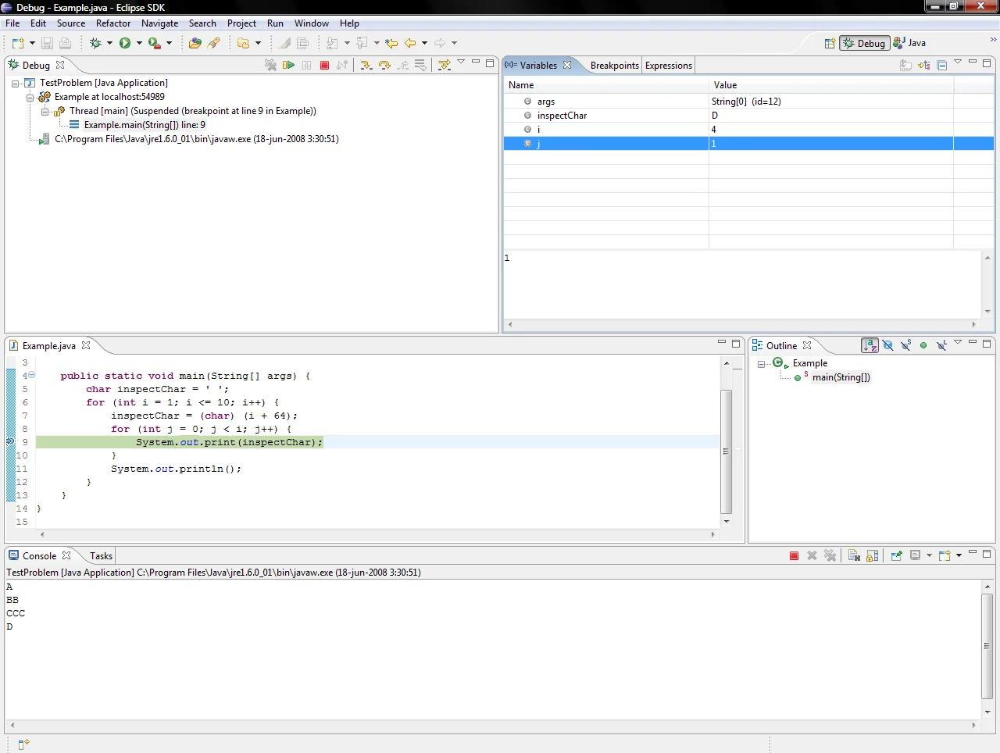

When you need to track down a complex bug, your first instinct is to reach for a visual debugger. You set a breakpoint, step through the logic, and inspect the stack trace. But in an era of agentic coding, IDEs and visual debuggers are a bottleneck.



*IDEs and their visual debuggers in the agentic coding era are not an option anymore 🙅 [Eclipse suspended at breakpoint](https://commons.wikimedia.org/wiki/File:Eclipse_suspended_at_breakpoint.png)*

The best next option is adding some logs as breadcrumbs to try to understand what is happening

```java
void processPayment() {
    System.out.println("Entering processPayment()");
    // ...
    if (isValid) {
        System.out.println("Processing valid payment: " + paymentId);
    }
}
```

It is a natural approach, but the feedback loop is slow in `Java`. Each change means compiling, packaging, and running again, or at best, a hot-reload. You make many code modifications just to understand what happens, but those print statements only work in your own code.

I need something my agent can use, the same way I use a visual debugger.

## JDB: The built-in command-line debugger for Java

I gave `jdb` a try, the command-line debugger that was always there (since jdk 1).

You can connect to a jvm that is running with the debugger options: 

```bash
java -agentlib:jdwp=transport=dt_socket,server=y,suspend=n,address=*:5005 MyClass
```

Then you can connect using that port:

```bash
jdb -attach 5005
```

This is an interactive tool where you send commands like:

- add breakpoints: `stop at com.saburto.Bar:46` or by method `stop at com.saburto.Bar.getAllLedgers`
- steps: `step`, `step up`,  `stepi`, `next`, `cont`
- get variables info: `print`, `dump`, `eval`, `locals`, `set`
- threads: `where`, `threadgroups`, `up`, `down`, `kill`, `interrupt`
- show source code: `use` to add the source code path, `list` to show the code

The source code looks clean in the output of the coding agent

```java
  42    @GetMapping
  43    public PageResponse<LedgerResponse> getAllLedgers(
  44            @RequestParam(defaultValue = "0") int page, @RequestParam(defaultValue = "20") int size) {
  45
  46 =>     var ledgers = ledgerService.getAllLedgers(page, size);
  47
  48        var content =
  49                ledgers.getContent().stream().map(mapper::toLedgerResponse).toList();
  50
  51        return new PageResponse<>(content, page, size, ledgers.getTotalElements(), ledgers.getTotalPages());
```

### Let your agent know the tools

Frontier models are intelligent enough to figure out how to call `jdb`, but if you want to lend a hand, create a skill using `man jdb` to document the key commands.

### Scenarios
1. **Dump a request payload**

   > Attach jdb to my app at port 5005, set a breakpoint at `LedgerController.getAllLedgers`, trigger `curl localhost:8080/api/ledgers`, and dump every field of the `ledgers` Page object. I want to see the actual database records returned.

2. **Trace a variable's mutations**

   > Set a breakpoint in `PaymentService.process`, step through line by line with `next`, and dump the `payment` variable after each line. I want to see how the status field changes as it moves through validation, enrichment, and persistence.

3. **Inspect concurrency at a checkpoint**

   > Break at the top of my scheduled job in `ReconciliationScheduler.run`, trigger a full thread dump with `where all`, and show me what every other thread is doing at that moment. Any thread blocked on a lock?

4. **Evaluate an expression in place**

   > Set a breakpoint at line 89 of `InvoiceCalculator`, and when it hits, run `eval invoice.getLineItems().stream().mapToDouble(LineItem::getTotal).sum()`. I want to verify the line-item math without adding a log line, rebuilding, and waiting for Maven.

5. **Debug exception state without re-deploying**

   > Break inside the catch block of `PaymentGateway.submit` (line 203), send a payment request with a bad card number, and when the breakpoint fires, dump the exception's message, cause chain, and the local variables. I want to see exactly what the gateway rejected and what state the request was in.

These prompts share a common shape: pick a breakpoint, trigger the code path, and let the agent extract the data. The agent handles the timing, the jdb commands, and the output parsing, and you get the answer in your terminal.

## Simple examples

### Checking variables in a request

For a Java application, you need to start the system with the proper arguments: `java -agentlib:jdwp=transport=dt_socket,server=y,suspend=n,address=*:5005 -jar app.jar`

For **spring-boot** application using `mvn`:

```bash
mvn spring-boot:run -Dspring-boot.run.jvmArguments="-agentlib:jdwp=transport=dt_socket,server=y,suspend=y,address=*:5005"
```

Then connect by attaching to the port: `jdb -attach 5005`, and that is it.

`jdb` is interactive by design, but in an agentic workflow the session must run hands-off, with the HTTP request firing while the debugger is attached and waiting.

> [!WARNING]
> This is only an example of how my agent generated the script to use the debugger. Depending on your case it may be different; let your agent create the right script.

Because the agent cannot type commands interactively into a debugger prompt, we pipeline the commands through standard input instead:

```bash
cd ~/projects/my-app && rm -f /tmp/jdb-output.txt && (
  echo "stop in com.saburto.ledger.controller.LedgerController.getAllLedgers"
  echo "cont"
  sleep 5
  echo "next"
  sleep 1
  echo "dump ledgers.content.elementData"
  echo "dump ledgers.content.elementData[0]"
  sleep 2
) | timeout 30 jdb -attach 5005 > /tmp/jdb-output.txt 2>&1 &
JDB_PID=$!
sleep 2
curl -s localhost:8080/api/v1/ledgers \
  -H "Authorization: Bearer $(./scripts/get-token.sh)" > /dev/null
wait $JDB_PID 2>/dev/null
echo "JDB_EXIT=$?"
```


Let's break this down:

1. The `( echo ... echo ... )` subshell pipes a sequence of `jdb` commands into the debugger. Each command goes in at the right time: set the breakpoint, continue, wait 5 seconds for the HTTP request to arrive and hit the breakpoint, then step over the assignment and dump the ledger data.
2. The whole thing runs in the **background** (`&`), with its PID captured.
3. After a 2-second head start, `curl` triggers the REST endpoint that runs `getAllLedgers()`.
4. The script then waits for jdb to finish and reports the exit code.

The agent reads `/tmp/jdb-output.txt` afterward.

The `next` command steps past the `var ledgers = ...` assignment before the dumps run. The `sleep` calls pace the commands so they arrive after the breakpoint fires. The agent reads the output file and reconstructs the data.

Now we see each `LedgerEntity` instance:

```text
ledgers.content.elementData[0] = {
    id: instance of java.util.UUID(id=15654)
    name: "Basic Transactions Ledger"
    createdAt: instance of java.time.Instant(id=15670)
    isNew: false
}
```


> [!TIP]
> Use **`tmux`** as the bridge between agent and debugger. Tell the agent to open a new panel or window in tmux and send all debugging commands there while keeping your coding agent open in the original pane. This is the pattern we use throughout this post, including the SQL extraction later, to keep the agent and `jdb` running in parallel.


### Printing the Header of the Http Request

Here is an example. Without touching a single line of code, I asked the agent to show me the HTTP request headers hitting a controller method. After a few tries, it delivered exactly what I needed:

```
Request Headers at LedgerController.getAllLedgers() (line 46, bci=0)

 ┌───┬───────────────┬─────────────────────────────────────────────────────────────┐
 │ # │ Header        │ Value                                                       │
 ├───┼───────────────┼─────────────────────────────────────────────────────────────┤
 │ 0 │ Host          │ localhost:8080                                              │
 ├───┼───────────────┼─────────────────────────────────────────────────────────────┤
 │ 1 │ User-Agent    │ curl/8.5.0                                                  │
 ├───┼───────────────┼─────────────────────────────────────────────────────────────┤
 │ 2 │ Accept        │ */*                                                         │
 ├───┼───────────────┼─────────────────────────────────────────────────────────────┤
 │ 3 │ Authorization │ Bearer                                                      │
 │   │               │ eyJraWQiOiJkZWZhdWx0IiwidHlwIjoiSldUIiwiYWxnIjoiUlMyNTYifQ. │
 │   │               │ ..                                                          │
 └───┴───────────────┴─────────────────────────────────────────────────────────────┘
```

#### How I got there (wrapper chain)

The request object at `DispatcherServlet.doDispatch` frame 15 goes through 5 nested `.request` fields:

```
SecurityContextHolderAwareRequestWrapper
  → HeaderWriterFilter$HeaderWriterRequest
    → (firewall wrapper)
      → RequestFacade
        → Request
          → coyoteRequest.headers  (MimeHeaders, count=4)
            → headers[0..3]        (MimeHeaderField with nameB/valueB MessageBytes)
```

No code changes, no rebuilds, no restart. Just the debugger, the agent, and a `tmux`

## Advanced debugging: chasing the SQL

Sometimes you need to dig deeper. I wanted to see the exact SQL that Spring Data JDBC sends, straight from the PostgreSQL wire. I started at the high level (`LedgerController.getAllLedgers`) and worked down through the stack, trying breakpoints until the right one stuck:

```
┌──────────────────────────────────────────────────────┬────────────────────────────────────────────────────────────────────────────────────┬────────┐
│ Layer                                                │ Breakpoint tried                                                                   │ Result │
├──────────────────────────────────────────────────────┼────────────────────────────────────────────────────────────────────────────────────┼────────┤
│ java.sql.Connection.prepareStatement(String)         │ Failed — Connection is an interface, jdb can't break on interfaces                 │        │
├──────────────────────────────────────────────────────┼────────────────────────────────────────────────────────────────────────────────────┼────────┤
│ org.postgresql.jdbc.PgConnection.prepareStatement    │ Never hit — HikariCP proxies the connection                                        │        │
├──────────────────────────────────────────────────────┼────────────────────────────────────────────────────────────────────────────────────┼────────┤
│ com.zaxxer.hikari.pool.ProxyPreparedStatement.<init> │ ✅ Hit — the Hikari wrapper constructor receives the real statement as an argument │        │
└──────────────────────────────────────────────────────┴────────────────────────────────────────────────────────────────────────────────────┴────────┘
```

### The key breakpoint

```
stop in com.zaxxer.hikari.pool.ProxyPreparedStatement.<init>
```

This fires every time HikariCP creates a prepared statement. The constructor signature accepts a statement parameter, the real `PgPreparedStatement` from the PostgreSQL driver.

### Extract the SQL from the driver internals

At the breakpoint, the statement variable is a `PgPreparedStatement` which has a `preparedQuery` field of type `CachedQuery`:

```
print statement.preparedQuery
→ CachedQuery{executeCount=10, query=SELECT "ledger_ledgers"."id" AS "id", ... LIMIT 20, isFunction=false}
```

The `CachedQuery.toString()` conveniently includes the full SQL string.

### Sending commands to a tmux pane

Since jdb ran interactively in a tmux pane, I used:

```bash
tmux send-keys -t 3 'print statement.preparedQuery' Enter
```

### Summary of the chain

```
curl → Tomcat → Spring MVC → LedgerController.getAllLedgers()
  → LedgerService → PagingAndSortingRepository.findAll(Pageable)
    → Spring Data JDBC → JdbcTemplate
      → HikariCP → ProxyPreparedStatement.<init>(conn, PgPreparedStatement)
                                                   ↑
                                         statement.preparedQuery = the SQL
```

#### Final Response

This is what it looks like the final response:

> [!NOTE]
> **SQL Queries Executed for `GET /api/v1/ledgers`**
>
> From the `ProxyPreparedStatement.<init>` breakpoint on `PgPreparedStatement`:
>
> ##### Query 1: COUNT (for pagination metadata)
>
> ```sql
> SELECT COUNT(*) FROM "ledger_ledgers"
> ```
>
> *(Earlier runs captured this: Spring Data JDBC executes the count first to populate `PageImpl.totalElements`)*
>
> ##### Query 2: SELECT data (with LIMIT)
>
> ```sql
> SELECT "ledger_ledgers"."id" AS "id",
>        "ledger_ledgers"."name" AS "name",
>        "ledger_ledgers"."created_at" AS "created_at"
> FROM "ledger_ledgers"
> LIMIT 20
> ```

## Conclusion

Agentic debugging is powerful. You get deep insights into your Java system's state in seconds, entirely hands-off. The days of manually hitting F10 to step through line by line are behind us.

`jdb` is just for `Java`, the same pattern applies to `gdb` for C/C++, `pdb` for Python, `dlv` for Go, or any debugger that exposes a command interface. If you can use in a terminal, the agent can use it.

So, do you still prefer hitting F9, F10, F11 to step through your code?
