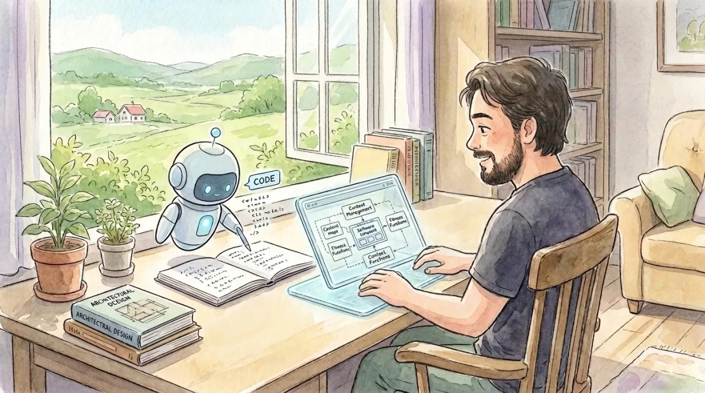
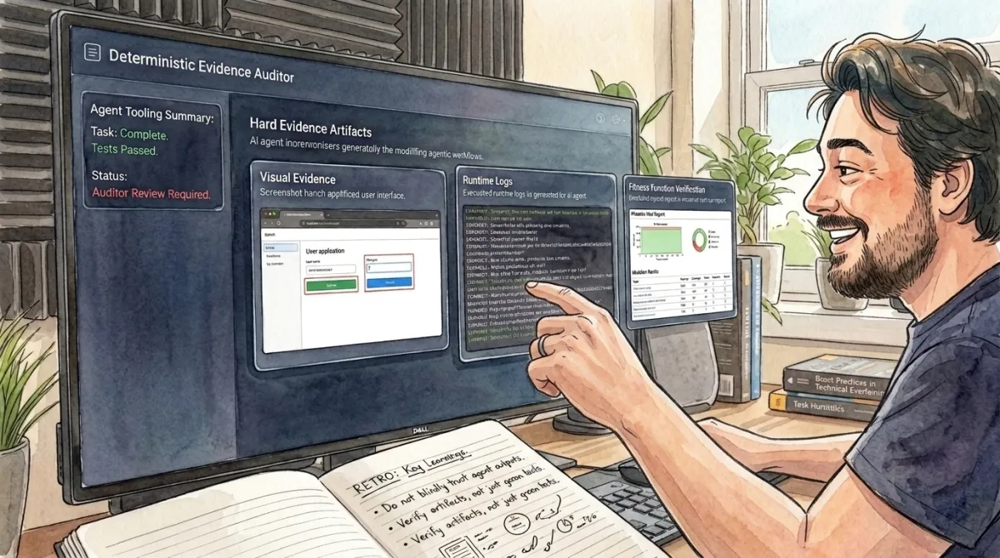
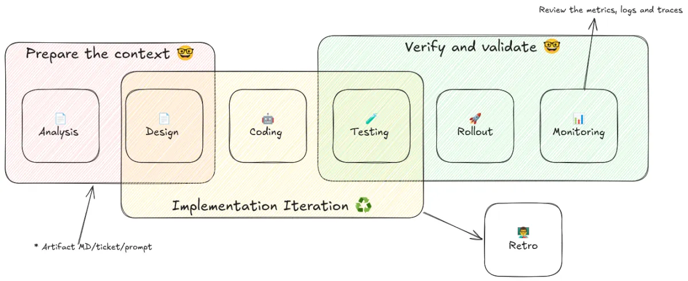

I am a hands-on software engineer with more than 17 years of experience, and I no longer write code. Yet, I still deliver software on a daily basis. I fix bugs, do analysis, design systems, implement new features, and test my changes.

For the actual coding, I have become the guide for my agentic coding tools. My responsibility is to give them the necessary context to make the changes. I define the acceptance criteria using deterministic verification, and I review the evidence to check the completeness and accuracy of the results.

*Guiding the agent tool to make the coding*

## Guiding like a junior programmer, but forever

Some people say that LLMs are like junior programmers because you have to give them proper guidance about everything. This analogy is true up to a certain point. The main difference is that a human junior developer becomes an expert over time. They make better decisions after making several mistakes, they generate trust within the team, they develop pride in their work, and eventually, they mentor and coach other developers.

But LLMs are in a perpetual juniorhood. You need to make sure their agents always have access to the necessary context, and that this context is real and updated. The agent needs access to the right tools in a secure environment, and it might need your assistance at any minute during the task.

## Managing the context

As a human, I need to retrieve the necessary information to start working on a task. Because this task is part of a system, I need to understand how the system works and what its functionality is. If I am already familiar with the system, I don't need to do much analysis. I just confirm the outcome I need to accomplish, understand the acceptance criteria, and make sure I have enough information to start the implementation.

Sadly, agent tools do not yet have the skill to read minds, so I must facilitate the discovery of the context. This context could be in a `spec.md` or `agent.md` file, a ticket that the agent can access using an MCP server, a `README.md`, or just directly in your prompt.

The environment where the agent runs is also important. It could be your laptop, a server, a Docker container, or a sandbox. Wherever it runs, the environment must mitigate security risks. You need to provide deterministic restrictions, like blocking internet access, restricting it from reading other folders, and managing repository access (for example, denying pushes to `main`).

Finally, it needs access to the right tools, MCPs, and skills. If you are working on a backend task, you probably don’t need a Playwright MCP. Try to avoid bloating the context with too many skills; make sure you only enable the right ones for the specific task.

> [!TIP]
> Avoid MCP servers as much as possible and prefer CLI tools. For example, use `playwright-cli`, `jira-cli`, `gh`, `glab`, etc.

## From human trust to hard evidence

*Verify everything from LLMs*

You can’t trust LLM results. They are non-deterministic. Even if you give them the perfect context, you can’t assume everything was done following the rules. Mistakes happen, and they will keep happening.

The way you verify the results depends on the context. It can vary from running automated tests and Playwright tests, to looking at screenshots and test results. Maybe you need ad-hoc reports showing the impact of the change in a development environment, or you need to run some manual steps. It changes depending on the nature of the task.

I only review the code after the agent does its own code review. If there is something I can really improve in the implementation, I leave a comment to guide the agent to make it better.

Later, you need to validate the results live in production, exactly the same way you would if you changed the code manually. You can also use the agent to help monitor that.

The last step is doing a retro. Save the important learnings. Maybe there was a common error that should become a new rule or a new deterministic tool to verify next time. This makes your next session faster and more token-cost effective.

*Overview of a common workflow for a development task*

## You can't blame the LLMs

Good software design, low coupling, high cohesion, high-quality code, and simplicity are still vital. Everything you already know about software engineering is still important. You are the human in charge. You make the decisions. Maybe you don’t craft the code line by line, and maybe you don’t review every single line, but you still need to ensure your output has high quality.

> [!WARNING]
> LLMs are not stable yet. Some days you get good results, but some days, especially right before a new model release, you can't believe how dumb they become. I hope model providers improve transparency about the real status of their services. The key is to have multiple providers ready as backups.

## Conclusion

Since the start of 2026, I have not produced a single line of code by hand. I rely completely on agentic coding tools powered by LLMs. I focus my effort on making sure these tools have enough context, and I take care to never trust the results they give me. Producing code now is cheaper, but producing high-quality software faster is not yet cheap. I still spend significant time verifying and validating the results. There is no silver bullet yet. I am still learning, and I am still trying to find better ways to develop software.  
